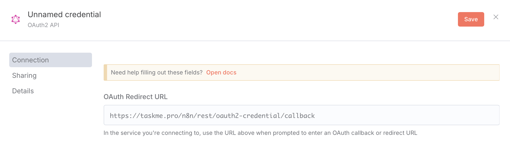
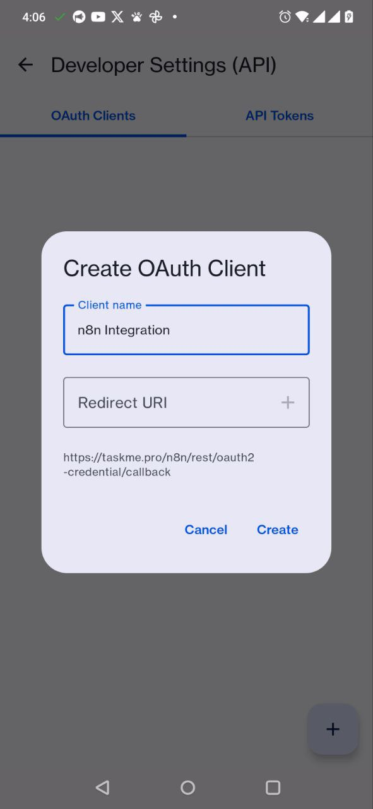
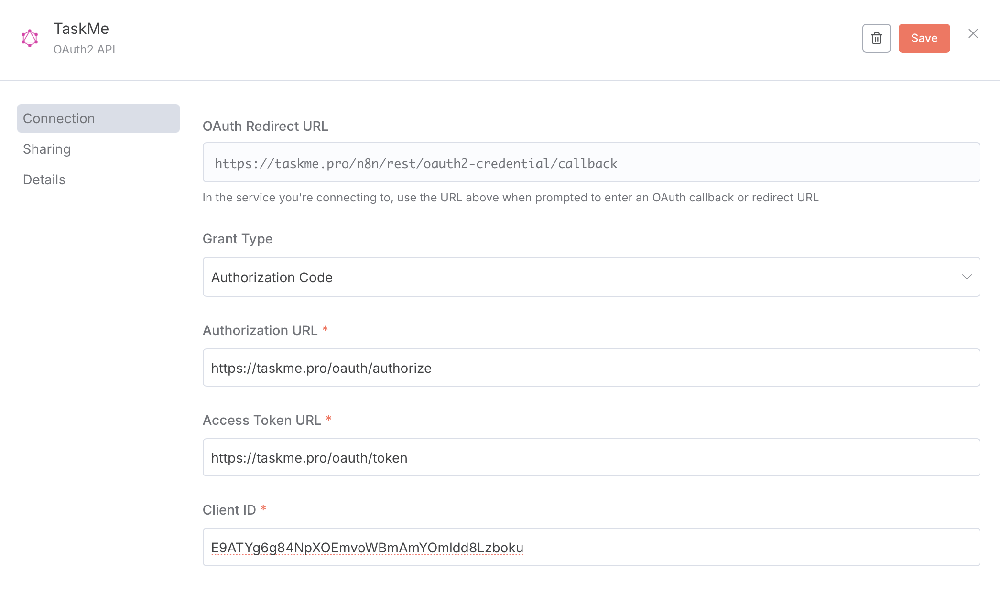
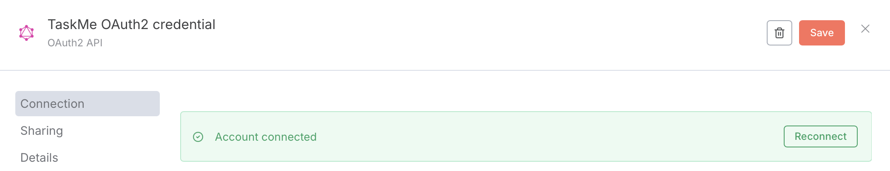

# Create OAuth2 Credential

Learn how to set up OAuth2 authentication for TaskMe in n8n using the OAuth2 API credentials.

## Prerequisites

Before you begin, make sure you have:
- TaskMe mobile app installed
- An n8n instance (cloud or self-hosted)
- Basic understanding of OAuth2 authentication flow

## Step 1: Get OAuth Redirect URL from n8n

First, you need to get the redirect URL from n8n to use when creating your OAuth client in TaskMe.

1. Open your n8n instance
2. Click on **Credentials** in the left sidebar
3. Click **"Add Credential"** button
4. Search for **"OAuth2 API"** and select it
5. At the top of the form, you'll see **"OAuth Redirect URL"**
6. **Copy this URL** (it looks like: `https://your-n8n-instance.com/rest/oauth2-credential/callback`)
7. Keep this URL handy - you'll need it in the next step



*Screenshot showing where to find the OAuth Redirect URL in n8n credential setup*

## Step 2: Create OAuth Client in TaskMe Mobile App

Now create the OAuth client in your TaskMe mobile app:

1. **Open TaskMe mobile app**
2. **Open the main menu** (tap the hamburger icon ☰ in the top-left corner)
3. Scroll down and tap **"Developer settings (API)"**
4. Tap on the **"OAuth clients"** tab
5. Tap the **"Create OAuth client"** button (usually a + icon or "New" button)


*Screenshot showing the main menu with Developer settings (API) option highlighted*

6. Fill in the OAuth client details:
   - **Name**: Enter a descriptive name like `n8n Integration` or `n8n Automation`
   - **Redirect URI**: Paste the OAuth Redirect URL you copied from n8n in Step 1
   


*Screenshot showing the OAuth client creation form with Name and Redirect URI fields*

7. Tap **"Create"** button

8. **Important**: After creation, you'll see your OAuth client details:
   - **Client ID** - Copy this
   - **Client Secret** - Copy this immediately (shown only once!)
   


*Screenshot showing the newly created OAuth client with Client ID and Client Secret displayed*

:::warning
The **Client Secret** is shown only once! Make sure to copy it immediately. If you lose it, you'll need to regenerate it or create a new OAuth client.
:::

## Step 3: Configure OAuth2 API Credential in n8n

Return to n8n and complete the credential setup:

1. Go back to the **OAuth2 API** credential form in n8n (from Step 1)
2. Fill in the following fields:

### Credential Name
```
TaskMe OAuth - Production
```
*Or any name you prefer*

### Grant Type
Select: **Authorization Code**

### Authorization URL
```
https://taskme.pro/oauth/authorize
```

### Access Token URL
```
https://taskme.pro/oauth/token
```

### Client ID
Paste the **Client ID** from TaskMe (copied in Step 2)

### Client Secret
Paste the **Client Secret** from TaskMe (copied in Step 2)

### Scope
```
read write admin
```
*Adjust scopes based on your needs. Available scopes: `read`, `write`, `admin`

### Auth URI Query Parameters
Leave empty (unless specified by TaskMe documentation)

### Authentication
Select: **Header**



*Screenshot showing the completed OAuth2 API credential form in n8n*

## Step 4: Authorize the Connection

1. Click the **"Connect my account"** button at the bottom of the n8n credential form
2. A new window will open with TaskMe's authorization page
3. Log in to TaskMe if prompted
4. Review the permissions being requested
5. Click **"Approve"** to grant access
6. You'll be redirected back to n8n automatically


*Screenshot showing the TaskMe authorization page asking for permission*

7. If successful, you'll see a green checkmark and **"Connected"** status in n8n



*Screenshot showing successful connection status in n8n*

## Step 5: Save and Test

1. Click **"Save"** button in n8n to save the credential
2. Your credential is now ready to use!

## Managing OAuth Clients in TaskMe

To view or manage your OAuth clients later:

1. Open TaskMe mobile app
2. Main menu → **Developer settings (API)**
3. **OAuth clients** tab
4. Here you can:
   - View all your OAuth clients
   - Regenerate Client Secret (if compromised)
   - Revoke access
   - Delete OAuth clients

## Troubleshooting

### Error: "Invalid redirect_uri"
**Solution**: 
- Make sure the Redirect URI in TaskMe exactly matches the OAuth Redirect URL from n8n
- Check for:
  - Trailing slashes (`/callback` vs `/callback/`)
  - Protocol (must be `https://` for production)
  - No extra spaces when copying/pasting

### Error: "Invalid client credentials"
**Solution**:
- Verify you copied the correct Client ID and Client Secret
- Check if you copied the complete secret (no truncation)
- Ensure the OAuth client is still active in TaskMe
- Try creating a new OAuth client if the secret was lost

### Error: "Insufficient scope"
**Solution**:
- Update the Scope field in n8n to include required permissions
- Common scopes: `read`, `write`, `admin`
- After updating, click "Connect my account" again to reauthorize

### Connection times out during authorization
**Solution**:
- Verify TaskMe API is accessible from your n8n instance
- If using self-hosted n8n, check firewall rules
- Try using a different browser or clearing cache
- Check TaskMe service status

### "Connection successful" but API calls fail
**Solution**:
- Verify the API endpoints are correct
- Check if your TaskMe account has the necessary permissions
- Review the scope settings - may need additional permissions
- Check API rate limits in TaskMe

## Security Best Practices

1. **Protect your Client Secret**
   - Never commit it to version control
   - Don't share it in screenshots or documentation
   - Store it securely in n8n credentials only

2. **Use separate OAuth clients**
   - Create different clients for development and production
   - Use descriptive names to identify each client's purpose

3. **Regularly audit access**
   - Review active OAuth clients in TaskMe regularly
   - Revoke unused or old clients
   - Monitor API usage for suspicious activity

4. **Limit scopes**
   - Only request the permissions your automation needs
   - Don't use `admin` scope unless absolutely necessary

5. **Rotate credentials**
   - If you suspect a secret is compromised, regenerate it immediately
   - Update the credential in n8n after regenerating

## Additional Resources

- [TaskMe API Documentation](https://taskme.pro/api/openapi)
- [n8n OAuth2 Documentation](https://docs.n8n.io/credentials/oauth/)
- [OAuth 2.0 Specification](https://oauth.net/2/)

## Need Help?

If you encounter issues:
- **Join our Discord**: [https://discord.gg/DKEFafKy](https://discord.gg/DKEFafKy)
- **Email support**: taskme.space@gmail.com
- **TaskMe Mobile App**: Settings → Contact Support