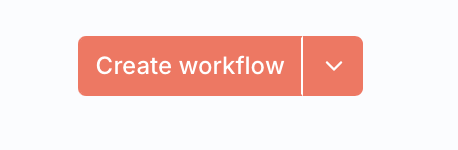
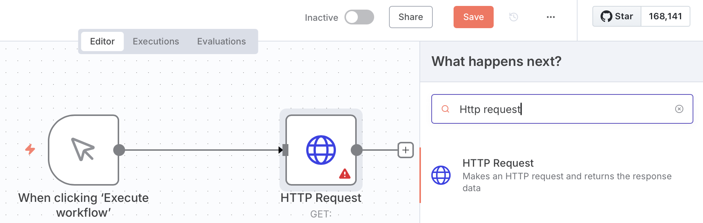
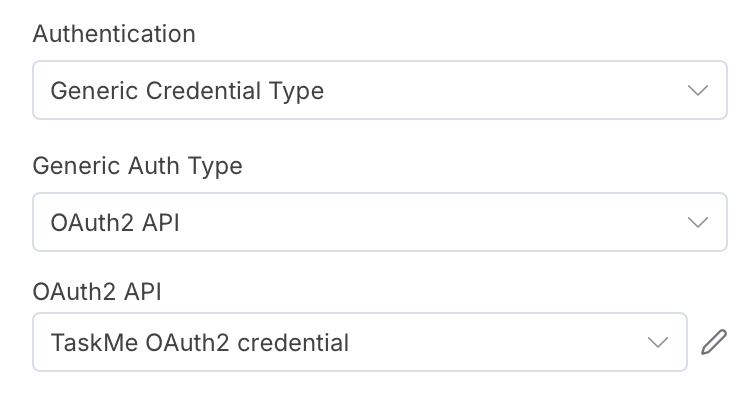
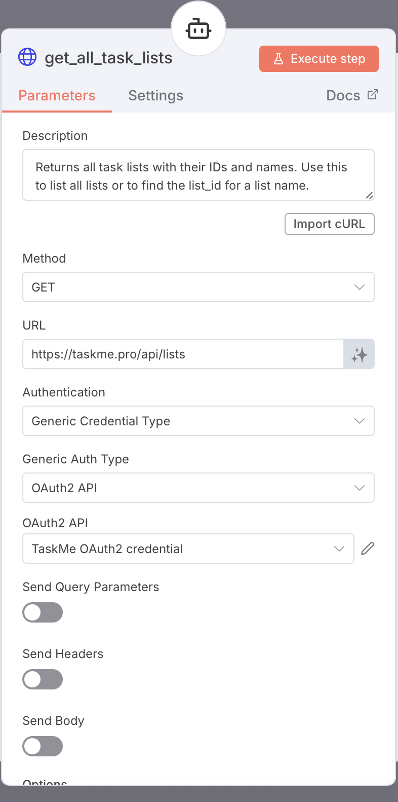

# Test TaskMe API Credentials

Learn how to test your TaskMe OAuth credentials by making an API call to verify the connection works correctly.

## Prerequisites

Before testing, make sure you have:
- Created OAuth credentials in n8n (see [Create OAuth2 Credential](./create-taskme-credential.md))
- Successfully connected your TaskMe account
- Access to n8n workflows

## What We'll Test

We'll test the credentials by calling the **Get All Task Lists** API endpoint:

```
GET https://taskme.pro/api/lists
```

This verifies:
- ✅ OAuth token is valid
- ✅ API connection works
- ✅ You have proper read permissions

---

## Step 1: Create Test Workflow in n8n

### 1.1 Create New Workflow

1. Open your n8n instance
2. Click **"New workflow"** button
3. Give it a name: `TaskMe API Test`



*Screenshot showing the new workflow creation in n8n*

### 1.2 Add Manual Trigger

1. Click the **"+"** button to add a node
2. Search for **"Manual Trigger"** or **"On clicking 'Execute Workflow'"**
3. Add it to the workflow


*Screenshot showing manual trigger node added*

---

## Step 2: Add HTTP Request Node

### 2.1 Add the Node

1. Click **"+"** after the Manual Trigger
2. Search for **"HTTP Request"**
3. Add the node



*Screenshot showing adding HTTP Request node*

---

## Step 3: Configure HTTP Request

### 3.1 Set Authentication

1. In the HTTP Request node, find **"Authentication"** section
2. Select: **"Predefined Credential Type"**
3. In the dropdown, choose: **"OAuth2 API"**
4. Select your credential: **"TaskMe OAuth2 credential"** (or whatever name you gave it)



*Screenshot showing authentication configuration with OAuth2 API selected*

### 3.2 Set Request Details

Configure the following fields:

**Method:**
```
GET
```

**URL:**
```
https://taskme.pro/api/lists
```

**Leave other settings as default:**
- Headers: (empty)
- Query Parameters: (empty)
- Body: (empty)



*Screenshot showing the complete HTTP Request configuration*

---

## Step 4: Execute and Verify

### 4.1 Run the Test

1. Click the **"Execute node"** button in the HTTP Request node
2. Wait for the response (usually 1-2 seconds)

### 4.2 Check the Response

If successful, you should see:

**Status Code:** `200 OK`

**Response Body Example:**
```json
[
  {
    "id": "44a33718-ac24-5aff-b453-80232c10fcaaa",
    "ownerId": "7562d5ae-2264-5512-8c7a-4effdd9a292a",
    "title": "My list",
    "showIndexNumbers": true,
    "isDefault": false,
    "isShared": false,
    "isOwner": false,
    "isTaskApprovalRequired": true,
    "isNotificationsMuted": false,
    "isActivityLogEnabled": false,
    "multiplePerformingMode": true,
    "template": {
      "id": "98beer98-61de-14ef-85dd-0aa2ac120004",
      "name": "default",
      "description": "default template"
    },
    "members": [],
    "taskProofMethods": [],
    "permission": {
      "view": true,
      "perform": false,
      "edit": false,
      "admin": false
    },
    "sortType": "ORDINAL",
    "sortDirection": "ASCENDING",
    "membersCount": 3,
    "pendingInvitationsCount": 0,
    "dateCreated": "2026-01-10T22:19:22.456Z",
    "lastModified": "2026-01-10T22:19:56.558Z",
    "ordinal": 0
  }
]
```


*Screenshot showing successful response with task lists data*

---

## Step 5: Save the Test Workflow

1. Click **"Save"** button at the top right
2. Your test workflow is now saved
3. You can run it anytime to verify your credentials

---

## Success! 🎉

If you see the task lists in the response, your credentials are working correctly!

You can now:
- ✅ Use these credentials in production workflows
- ✅ Make other API calls to TaskMe
- ✅ Build automation with confidence

---

## Troubleshooting

### Error: 401 Unauthorized

**Symptoms:**
- HTTP Status: `401`
- Error message in response

**Example Response:**
```json
{
  "status": 401,
  "error": "Unauthorized",
  "message": "Invalid or expired access token"
}
```

**Solution:**
1. Go to **Credentials** in n8n sidebar
2. Find your **TaskMe OAuth** credential
3. Click the **"⋮" menu** → **"Open credential"**
4. Click **"Connect my account"** button again
5. Authorize with TaskMe
6. Save and retry the test


*Screenshot showing how to reconnect OAuth credentials*

---

### Error: Connection Timeout

**Symptoms:**
- Request takes too long
- Eventually fails with timeout error

**Solution:**
1. Check your internet connection
2. Verify TaskMe API is accessible: Visit https://taskme.pro in your browser
3. If using self-hosted n8n, check firewall settings
4. Try again in a few minutes

---

## Next Steps

Now that your credentials are tested and working:

1. **Explore Other Endpoints:**
   - Get tasks in a list: `GET /api/lists/{list_id}/tasks`
   - Create new task: `POST /api/lists/{list_id}/tasks`

2. **Build Real Workflows:**
   - Sync tasks with other tools
   - Create automated reports
   - Set up notifications

3. **Read the Documentation:**
   - [TaskMe API Documentation](https://taskme.pro/docs)
   - [n8n HTTP Request Node](https://docs.n8n.io/integrations/builtin/core-nodes/n8n-nodes-base.httprequest/)

---

## Additional Resources

- [Create TaskMe credential in n8n](./create-taskme-credential.md) - Setup guide
- [TaskMe API Documentation](https://taskme.pro/api/openapi) - Full API reference

## Need Help?

If you encounter issues while testing:
- **Email support**: taskme.space@gmail.com
- **Discord**: [https://discord.gg/DKEFafKy](https://discord.gg/DKEFafKy)
- **TaskMe App**: Settings → Contact support