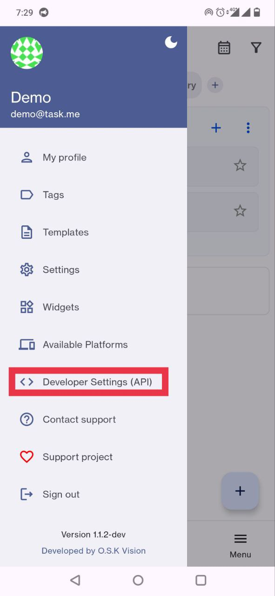
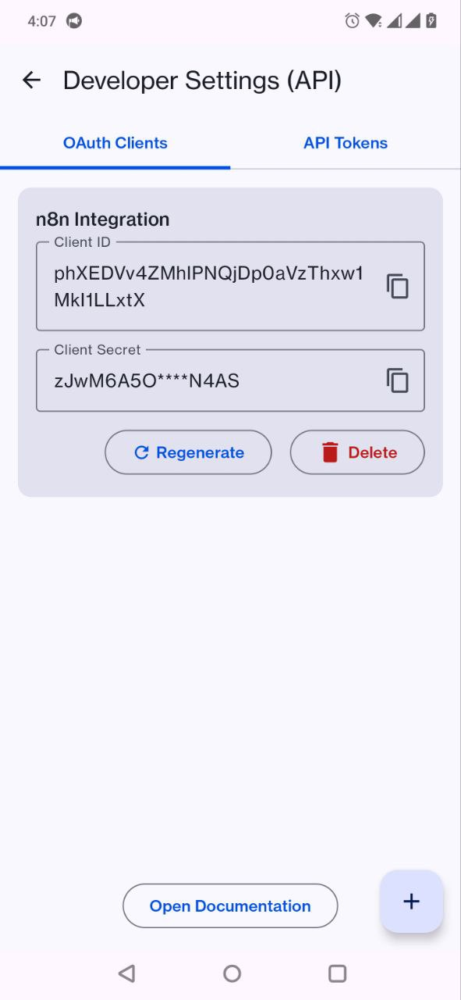
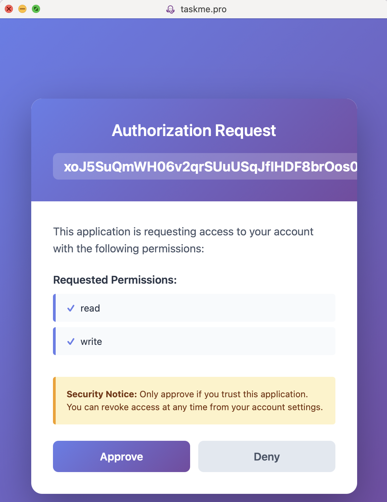

# Створення облікових даних OAuth2

Дізнайтеся, як налаштувати OAuth2 автентифікацію для TaskMe в n8n, використовуючи облікові дані OAuth2 API.

## Передумови

Перед початком переконайтеся, що у вас є:
- Встановлений мобільний додаток TaskMe
- Екземпляр n8n (хмарний або власний)
- Базове розуміння процесу автентифікації OAuth2

## Крок 1: Отримання URL переадресації OAuth з n8n

Спочатку вам потрібно отримати URL переадресації з n8n для використання при створенні OAuth-клієнта в TaskMe.

1. Відкрийте свій екземпляр n8n
2. Натисніть на **Credentials** (Облікові дані) на лівій бічній панелі
3. Натисніть кнопку **"Add Credential"** (Додати облікові дані)
4. Знайдіть **"OAuth2 API"** і виберіть його
5. У верхній частині форми ви побачите **"OAuth Redirect URL"** (URL переадресації OAuth)
6. **Скопіюйте цей URL** (він виглядає приблизно так: `https://your-n8n-instance.com/rest/oauth2-credential/callback`)
7. Збережіть цей URL - він знадобиться вам на наступному кроці


*Знімок екрана, що показує, де знайти URL переадресації OAuth при налаштуванні облікових даних n8n*

## Крок 2: Створення OAuth-клієнта в мобільному додатку TaskMe

Тепер створіть OAuth-клієнта у вашому мобільному додатку TaskMe:

1. **Відкрийте мобільний додаток TaskMe**
2. **Відкрийте головне меню** (натисніть на значок гамбургера ☰ у верхньому лівому куті)
3. Прокрутіть вниз і натисніть **"Developer settings (API)"** (Налаштування розробника (API))
4. Натисніть на вкладку **"OAuth clients"** (OAuth-клієнти)
5. Натисніть кнопку **"Create OAuth client"** (Створити OAuth-клієнта) (зазвичай значок + або кнопка "New" (Новий))



*Знімок екрана, що показує головне меню з виділеною опцією "Налаштування розробника (API)"*

6. Заповніть деталі OAuth-клієнта:
   - **Name** (Назва): Введіть описову назву, наприклад `n8n Integration` або `n8n Automation`
   - **Redirect URI** (URI переадресації): Вставте URL переадресації OAuth, який ви скопіювали з n8n на кроці 1
   


*Знімок екрана, що показує форму створення OAuth-клієнта з полями "Назва" та "URI переадресації"*

7. Натисніть кнопку **"Create"** (Створити)

8. **Важливо**: Після створення ви побачите деталі вашого OAuth-клієнта:
   - **Client ID** (Ідентифікатор клієнта) - Скопіюйте його
   - **Client Secret** (Секретний ключ клієнта) - Скопіюйте його негайно (показується лише один раз!)
   


*Знімок екрана, що показує новостворений OAuth-клієнт з відображеними Client ID та Client Secret*

:::warning
**Client Secret** показується лише один раз! Обов'язково скопіюйте його негайно. Якщо ви його втратите, вам доведеться згенерувати новий або створити новий OAuth-клієнт.
:::

## Крок 3: Налаштування облікових даних OAuth2 API в n8n

Поверніться до n8n і завершіть налаштування облікових даних:

1. Поверніться до форми облікових даних **OAuth2 API** в n8n (з кроку 1)
2. Заповніть наступні поля:

### Назва облікових даних
```
TaskMe OAuth - Production
```
*Або будь-яка назва на ваш вибір*

### Тип надання доступу (Grant Type)
Виберіть: **Authorization Code** (Код авторизації)

### URL авторизації (Authorization URL)
```
https://taskme.pro/oauth/authorize
```

### URL токена доступу (Access Token URL)
```
https://taskme.pro/oauth/token
```

### Ідентифікатор клієнта (Client ID)
Вставте **Client ID** з TaskMe (скопійований на кроці 2)

### Секретний ключ клієнта (Client Secret)
Вставте **Client Secret** з TaskMe (скопійований на кроці 2)

### Область доступу (Scope)
```
read write admin
```
*Налаштуйте області доступу відповідно до ваших потреб. Доступні області: `read`, `write`, `admin`*

### Параметри запиту Auth URI
Залиште порожнім (якщо не вказано в документації TaskMe)

### Автентифікація (Authentication)
Виберіть: **Header** (Заголовок)


*Знімок екрана, що показує заповнену форму облікових даних OAuth2 API в n8n*

## Крок 4: Авторизація з'єднання

1. Натисніть кнопку **"Connect my account"** (Підключити мій обліковий запис) внизу форми облікових даних n8n
2. Відкриється нове вікно зі сторінкою авторизації TaskMe
3. Увійдіть у TaskMe, якщо буде запропоновано
4. Перегляньте запитувані дозволи
5. Натисніть **"Approve"** (Схвалити), щоб надати доступ
6. Вас автоматично переспрямують назад до n8n



*Знімок екрана, що показує сторінку авторизації TaskMe з запитом дозволу*

7. Якщо успішно, ви побачите зелену галочку та статус **"Connected"** (Підключено) в n8n


*Знімок екрана, що показує статус успішного з'єднання в n8n*

## Крок 5: Збереження та тестування

1. Натисніть кнопку **"Save"** (Зберегти) в n8n, щоб зберегти облікові дані
2. Ваші облікові дані тепер готові до використання!

## Управління OAuth-клієнтами в TaskMe

Щоб переглянути або керувати вашими OAuth-клієнтами пізніше:

1. Відкрийте мобільний додаток TaskMe
2. Головне меню → **Developer settings (API)** (Налаштування розробника (API))
3. Вкладка **OAuth clients** (OAuth-клієнти)
4. Тут ви можете:
   - Переглядати всі ваші OAuth-клієнти
   - Регенерувати Client Secret (якщо скомпрометовано)
   - Відкликати доступ
   - Видаляти OAuth-клієнти

## Усунення несправностей

### Помилка: "Invalid redirect_uri"
**Рішення**: 
- Переконайтеся, що Redirect URI в TaskMe точно відповідає OAuth Redirect URL з n8n
- Перевірте:
  - Кінцеві слеші (`/callback` vs `/callback/`)
  - Протокол (має бути `https://` для продакшену)
  - Відсутність зайвих пробілів при копіюванні/вставці

### Помилка: "Invalid client credentials"
**Рішення**:
- Переконайтеся, що ви скопіювали правильні Client ID та Client Secret
- Перевірте, чи скопіювали ви повний секретний ключ (без обрізання)
- Переконайтеся, що OAuth-клієнт все ще активний у TaskMe
- Спробуйте створити новий OAuth-клієнт, якщо секретний ключ було втрачено

### Помилка: "Insufficient scope"
**Рішення**:
- Оновіть поле Scope в n8n, щоб включити необхідні дозволи
- Поширені області: `read`, `write`, `admin`
- Після оновлення натисніть "Connect my account" знову для повторної авторизації

### Тайм-аут з'єднання під час авторизації
**Рішення**:
- Переконайтеся, що API TaskMe доступний з вашого екземпляра n8n
- Якщо використовується власний n8n, перевірте правила брандмауера
- Спробуйте використати інший браузер або очистити кеш
- Перевірте статус сервісу TaskMe

### "Connection successful", але виклики API не спрацьовують
**Рішення**:
- Переконайтеся, що API endpoints правильні
- Перевірте, чи має ваш обліковий запис TaskMe необхідні дозволи
- Перегляньте налаштування областей доступу - можуть знадобитися додаткові дозволи
- Перевірте ліміти швидкості API в TaskMe

## Найкращі практики безпеки

1. **Захищайте свій Client Secret**
   - Ніколи не додавайте його до системи контролю версій
   - Не діліться ним у знімках екрана або документації
   - Зберігайте його безпечно лише в облікових даних n8n

2. **Використовуйте окремі OAuth-клієнти**
   - Створюйте різні клієнти для розробки та продакшену
   - Використовуйте описові назви для ідентифікації призначення кожного клієнта

3. **Регулярно перевіряйте доступ**
   - Регулярно переглядайте активні OAuth-клієнти в TaskMe
   - Відкликайте невикористовувані або старі клієнти
   - Відстежуйте використання API на предмет підозрілої активності

4. **Обмежуйте області доступу**
   - Запитуйте лише ті дозволи, які потрібні вашій автоматизації
   - Не використовуйте область `admin`, якщо це не абсолютно необхідно

5. **Ротація облікових даних**
   - Якщо ви підозрюєте, що секретний ключ скомпрометовано, негайно регенеруйте його
   - Оновіть облікові дані в n8n після регенерації

## Додаткові ресурси

- [Документація API TaskMe](https://taskme.pro/api/openapi)
- [Документація OAuth2 n8n](https://docs.n8n.io/credentials/oauth/)
- [Специфікація OAuth 2.0](https://oauth.net/2/)

## Потрібна допомога?

Якщо у вас виникли проблеми:
- **Приєднуйтесь до нашого Discord**: [https://discord.gg/DKEFafKy](https://discord.gg/DKEFafKy)
- **Email підтримки**: taskme.space@gmail.com
- **Мобільний додаток TaskMe**: Налаштування → Зв'язатися з підтримкою