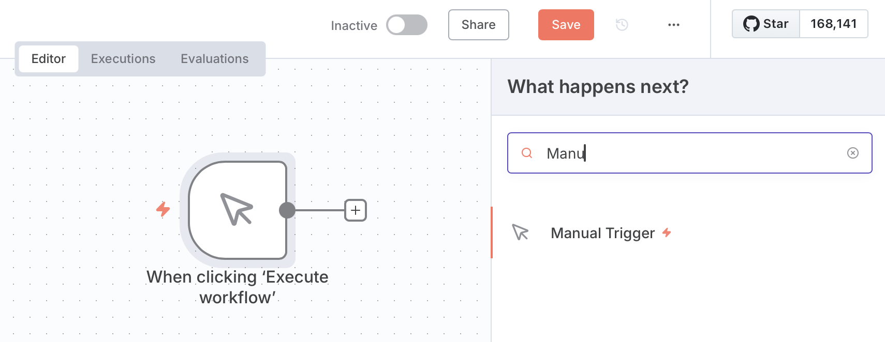
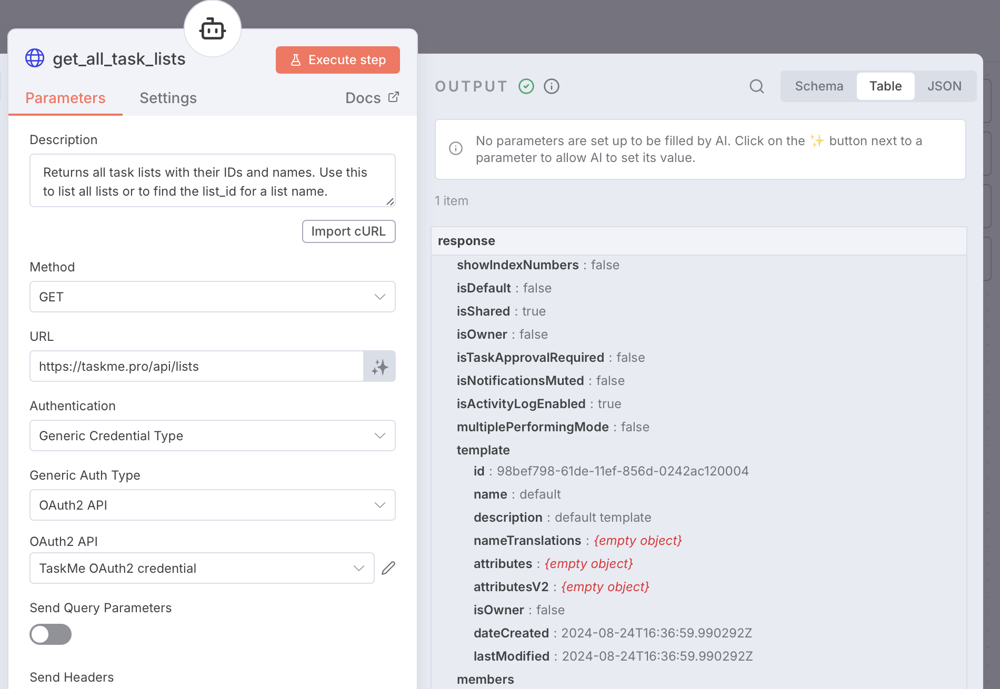
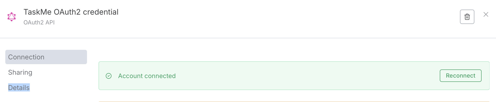

# Тестування облікових даних API TaskMe

Дізнайтеся, як протестувати ваші облікові дані OAuth TaskMe, виконавши виклик API для перевірки правильності з'єднання.

## Передумови

Перед тестуванням переконайтеся, що у вас є:
- Створені облікові дані OAuth в n8n (див. [Створення облікових даних OAuth2](./create-taskme-credential.md))
- Успішно підключений ваш обліковий запис TaskMe
- Доступ до робочих процесів n8n

## Що ми будемо тестувати

Ми протестуємо облікові дані, викликавши API endpoint **Отримати всі списки завдань**:

```
GET https://taskme.pro/api/lists
```

Це перевіряє:
- ✅ OAuth токен дійсний
- ✅ З'єднання з API працює
- ✅ У вас є належні дозволи на читання

---

## Крок 1: Створення тестового робочого процесу в n8n

### 1.1 Створення нового робочого процесу

1. Відкрийте свій екземпляр n8n
2. Натисніть кнопку **"New workflow"** (Новий робочий процес)
3. Дайте йому назву: `TaskMe API Test`


*Знімок екрана, що показує створення нового робочого процесу в n8n*

### 1.2 Додавання ручного тригера

1. Натисніть кнопку **"+"**, щоб додати вузол
2. Знайдіть **"Manual Trigger"** (Ручний тригер) або **"On clicking 'Execute Workflow'"** (При натисканні 'Виконати робочий процес')
3. Додайте його до робочого процесу



*Знімок екрана, що показує доданий вузол ручного тригера*

---

## Крок 2: Додавання вузла HTTP Request

### 2.1 Додавання вузла

1. Натисніть **"+"** після ручного тригера
2. Знайдіть **"HTTP Request"** (HTTP запит)
3. Додайте вузол


*Знімок екрана, що показує додавання вузла HTTP Request*

---

## Крок 3: Налаштування HTTP Request

### 3.1 Налаштування автентифікації

1. У вузлі HTTP Request знайдіть розділ **"Authentication"** (Автентифікація)
2. Виберіть: **"Predefined Credential Type"** (Попередньо визначений тип облікових даних)
3. У випадаючому списку виберіть: **"OAuth2 API"**
4. Виберіть ваші облікові дані: **"TaskMe OAuth2 credential"** (або будь-яку назву, яку ви дали)


*Знімок екрана, що показує налаштування автентифікації з вибраним OAuth2 API*

### 3.2 Налаштування деталей запиту

Налаштуйте наступні поля:

**Метод:**
```
GET
```

**URL:**
```
https://taskme.pro/api/lists
```

**Залиште інші налаштування за замовчуванням:**
- Headers (Заголовки): (порожньо)
- Query Parameters (Параметри запиту): (порожньо)
- Body (Тіло): (порожньо)


*Знімок екрана, що показує повну конфігурацію HTTP Request*

---

## Крок 4: Виконання та перевірка

### 4.1 Запуск тесту

1. Натисніть кнопку **"Execute node"** (Виконати вузол) у вузлі HTTP Request
2. Зачекайте на відповідь (зазвичай 1-2 секунди)

### 4.2 Перевірка відповіді

Якщо успішно, ви повинні побачити:

**Код статусу:** `200 OK`

**Приклад тіла відповіді:**
```json
[
  {
    "id": "44a33718-ac24-5aff-b453-80232c10fcaaa",
    "ownerId": "7562d5ae-2264-5512-8c7a-4effdd9a292a",
    "title": "Мій список",
    "showIndexNumbers": true,
    "isDefault": false,
    "isShared": false,
    "isOwner": false,
    "isTaskApprovalRequired": true,
    "isNotificationsMuted": false,
    "isActivityLogEnabled": false,
    "multiplePerformingMode": true,
    "template": {
      "id": "98beer98-61de-14ef-85dd-0aa2ac120004",
      "name": "default",
      "description": "шаблон за замовчуванням"
    },
    "members": [],
    "taskProofMethods": [],
    "permission": {
      "view": true,
      "perform": false,
      "edit": false,
      "admin": false
    },
    "sortType": "ORDINAL",
    "sortDirection": "ASCENDING",
    "membersCount": 3,
    "pendingInvitationsCount": 0,
    "dateCreated": "2026-01-10T22:19:22.456Z",
    "lastModified": "2026-01-10T22:19:56.558Z",
    "ordinal": 0
  }
]
```



*Знімок екрана, що показує успішну відповідь з даними списків завдань*

---

## Крок 5: Збереження тестового робочого процесу

1. Натисніть кнопку **"Save"** (Зберегти) у верхньому правому куті
2. Ваш тестовий робочий процес тепер збережено
3. Ви можете запускати його в будь-який час для перевірки ваших облікових даних

---

## Успіх! 🎉

Якщо ви бачите списки завдань у відповіді, ваші облікові дані працюють правильно!

Тепер ви можете:
- ✅ Використовувати ці облікові дані у продакшн робочих процесах
- ✅ Виконувати інші виклики API до TaskMe
- ✅ Створювати автоматизацію з упевненістю

---

## Усунення несправностей

### Помилка: 401 Unauthorized (Не авторизовано)

**Симптоми:**
- HTTP статус: `401`
- Повідомлення про помилку у відповіді

**Приклад відповіді:**
```json
{
  "status": 401,
  "error": "Unauthorized",
  "message": "Invalid or expired access token"
}
```

**Рішення:**
1. Перейдіть до **Credentials** (Облікові дані) на бічній панелі n8n
2. Знайдіть ваші облікові дані **TaskMe OAuth**
3. Натисніть меню **"⋮"** → **"Open credential"** (Відкрити облікові дані)
4. Натисніть кнопку **"Connect my account"** (Підключити мій обліковий запис) знову
5. Авторизуйтеся в TaskMe
6. Збережіть і повторіть тест



*Знімок екрана, що показує, як повторно підключити облікові дані OAuth*

---

### Помилка: Connection Timeout (Час очікування з'єднання вичерпано)

**Симптоми:**
- Запит займає занадто багато часу
- Зрештою завершується помилкою тайм-ауту

**Рішення:**
1. Перевірте ваше інтернет-з'єднання
2. Переконайтеся, що API TaskMe доступний: Відвідайте https://taskme.pro у вашому браузері
3. Якщо використовується власний n8n, перевірте налаштування брандмауера
4. Спробуйте знову через кілька хвилин

---

## Наступні кроки

Тепер, коли ваші облікові дані протестовані та працюють:

1. **Дослідіть інші endpoints:**
   - Отримати завдання у списку: `GET /api/lists/{list_id}/tasks`
   - Створити нове завдання: `POST /api/lists/{list_id}/tasks`

2. **Створюйте реальні робочі процеси:**
   - Синхронізуйте завдання з іншими інструментами
   - Створюйте автоматизовані звіти
   - Налаштуйте сповіщення

3. **Читайте документацію:**
   - [Документація API TaskMe](https://taskme.pro/docs)
   - [Вузол HTTP Request n8n](https://docs.n8n.io/integrations/builtin/core-nodes/n8n-nodes-base.httprequest/)

---

## Додаткові ресурси

- [Створення облікових даних TaskMe в n8n](./create-taskme-credential) - Посібник з налаштування
- [Документація API TaskMe](https://taskme.pro/api/openapi) - Повний довідник API

## Потрібна допомога?

Якщо у вас виникли проблеми під час тестування:
- **Email підтримки**: taskme.space@gmail.com
- **Discord**: [https://discord.gg/DKEFafKy](https://discord.gg/DKEFafKy)
- **Додаток TaskMe**: Налаштування → Зв'язатися з підтримкою